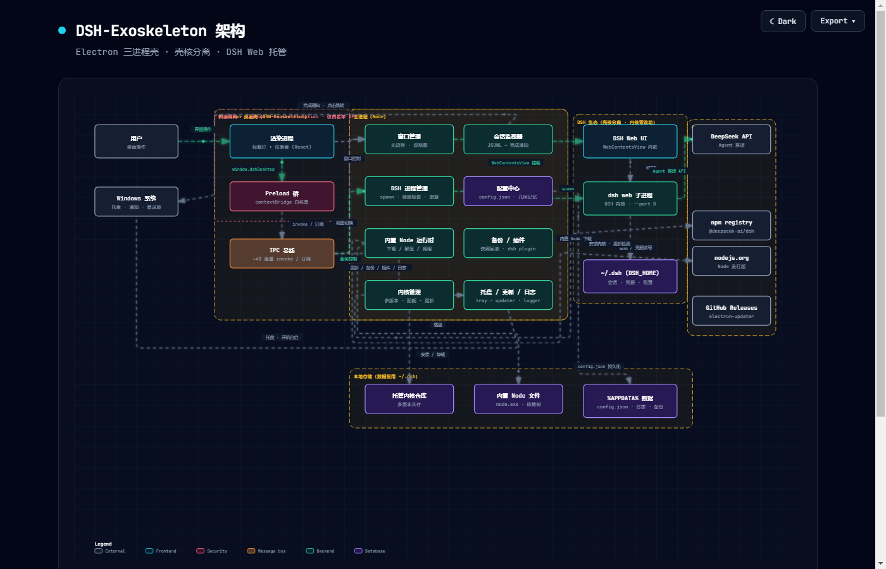

# DeepSeek Harness Desktop Client (DSH-Exoskeleton)

[中文](README.md) | [English](README.en.md)

> A unified development plan based on research of 7 community DSH desktop projects ([Dev Doc](DEV_DOC.md)).

A lightweight, clean, feature-complete DSH desktop shell: wraps the official `dsh web` into a **double-click-to-run** Windows desktop app.
Following the **shell-kernel separation** principle — **no changes to the DSH core**, seamless tracking of official upgrades; by default shares `~/.dsh`, so existing configs require zero migration.

## Features

| Module | Description |
| :--- | :--- |
| DSH subprocess management | Start/stop/restart `dsh web`, `--port 0` auto-assigns the port, health checks, auto-restart on crash |
| Native window | Frameless window + custom-drawn title bar + real-time status dot (cyan = running / grey = starting / red = error) |
| System tray | Single-click to restore, right-click menu (open / start-stop service / launch at startup / logs / update / about / quit) |
| Single instance | Double-click brings up the existing window |
| Dashboard | Unified management panel for status / settings / logs / updates |
| First-run wizard | Detects `~/.dsh/.credentials.yaml`; shows a wizard when no API Key is configured and writes the Key into the local credentials file |
| Native notifications | Windows notifications for service ready / error / crash-restart / session done / **question card awaiting answer** (toggleable) |
| Backup & rollback | Manual archive + automatic snapshots (before plugin install/uninstall, before restore) + one-click rollback; snapshots stored in `userData\backups` |
| Plugin management | GitHub topic `dsh-plugin` + npm dual-source catalogs, one-click install/uninstall (reuses `dsh plugin`), conflict pre-check + automatic backup before operations |
| Auto-update | NSIS installers use electron-updater silent download → notify → one-click restart & install; the portable build guides a manual download |
| Kernel management (Phase A/B/C/D) | DSH multi-version coexistence: install / default routing / uninstall + built-in Node runtime (zero barrier) + first-launch default kernel provisioning + kernel update detection & one-click upgrade + multi-Profile kernel binding + disk quota + **compat-patch auto-injection for buggy alpha kernels (R-24: trial-boot gate + crash auto-rollback)** |
| Data reuse | `DSH_HOME` environment variable takes priority, otherwise `%USERPROFILE%\.dsh` |
| Security isolation | Listens only on `127.0.0.1`, renderer sandbox, `contextIsolation`, Node integration disabled |

## Tech Stack

Electron + TypeScript + React + Tailwind CSS + Vite (electron-vite) + electron-builder

## Architecture Overview



> Interactive animated version: [View architecture diagram (GitHub Pages)](https://qgx1992.github.io/DSH-Exoskeleton/docs/dsh-architecture.html)
> When Pages is not enabled, use this third-party preview: [htmlpreview](https://htmlpreview.github.io/?https://github.com/qgx1992/DSH-Exoskeleton/blob/main/docs/dsh-architecture.html)

## Directory Structure

```
├── src/
│   ├── main/          # Electron main process
│   │   ├── index.ts           # Entry: window / lifecycle / single instance
│   │   ├── window-manager.ts  # Frameless window + WebContentsView hosting the DSH Web UI
│   │   ├── dsh-manager.ts     # DSH subprocess management (start/stop/health check/crash-restart)
│   │   ├── tray.ts            # System tray
│   │   ├── updater.ts         # Update checks
│   │   ├── ipc-handlers.ts    # IPC communication
│   │   ├── config.ts          # Config management (userData/config.json)
│   │   └── logger.ts          # File logging (rotated)
│   ├── preload/       # Typed contextBridge bridge
│   └── renderer/      # Shell UI (title bar + dashboard)
│       └── components/panels/ # Status / Settings / Logs / Updates
├── shared/            # Shared types between main and renderer
├── resources/         # Icons
├── scripts/           # Icon generation and other scripts
├── electron-builder.yml
└── electron.vite.config.ts
```

## Development

```bash
# Install dependencies
npm install

# Generate icons (first time)
npm run gen:icon

# Development mode (HMR)
npm run dev

# Type check
npm run typecheck

# Build
npm run build

# Package (NSIS installer + portable)
npm run dist
```

## Build Artifacts

```
dist/DSH-Exoskeleton-Setup-0.6.3.exe          # NSIS installer
dist/DSH-Exoskeleton-Portable-0.6.3.exe       # Single-file portable build
dist/win-unpacked/                            # Portable folder (no install needed)
```

## DSH Executable Resolution

The main process locates `dsh` in the following order:

1. The `DSH_EXECUTABLE` environment variable (explicitly specified)
2. npm/pnpm global install of `@deepseek-ai/dsh` (`lib/bin.js` is run directly by Node, no path dependency)
3. `dsh.cmd` on the PATH

> "Zero barrier" goal: future versions will bundle a DSH kernel so users don't have to install dsh manually.

## Configuration

Stored in `%APPDATA%\DSH-Exoskeleton\config.json`:

| Config | Purpose | Default |
| :--- | :--- | :--- |
| `port` | Web service port | `0` (auto-assigned) |
| `workspace` | Agent workspace (reserved) | empty |
| `autoLaunch` | Launch at startup | `false` |
| `apiKey` | DeepSeek API Key (system-level encryption, P1 guide) | empty |
| `dshHome` | DSH Home override | empty (official rules) |
| `activeProfileId` | Active configuration profile | `default` |
| `kernelsQuotaMB` | Kernel store disk quota (MB, 0 = unlimited) | `1024` |
| `defaultKernelVersion` | Default managed kernel version (written by first-launch provisioning) | `null` |
| `autoStartService` | Auto-start service at launch | `true` |
| `minimizeToTray` | Close window hides to tray | `true` |

## Logs

`%APPDATA%\DSH-Exoskeleton\dsh-desktop.log` (2MB rotation); the dashboard provides real-time viewing, and the tray menu can open the log directory.

## Roadmap

- [x] Phase 1 — MVP: scaffolding / native window / tray / single instance / DSH process management / auto port assignment
- [x] Phase 2 — Experience polish: API Key first-run wizard / data reuse / security isolation / log viewer / native notifications / launch at startup
- [x] Phase 3 (mostly): auto-update (electron-updater silent download + one-click restart) / dashboard (status / settings / kernel / plugins / backups / logs / updates) /
      plugin manager (dual-source catalogs + conflict pre-check + auto backup) / backup & rollback / three distribution forms
- [x] Kernel management Phase A/B/C/D: managed install / default routing / uninstall; built-in Node runtime (truly zero barrier); first-launch default kernel provisioning (auto-ready on fresh installs);
      kernel update detection + one-click upgrade; multi-Profile kernel binding (profile panel); disk quota & uninstall reference protection
- [ ] Phase 4: cross-platform / community ecosystem

## Kernel Management (Phase B/C/D shipped)

- **First-launch default kernel provisioning (Phase D)**: on a fresh install, the default kernel (currently `0.1.2-alpha.4`, see `src/shared/kernel-defaults.ts`) is installed automatically on first launch and set as the default — machines without Node download the built-in runtime first; upgrading users are skipped automatically, and failures retry on the next launch.
- **Built-in Node runtime**: one-click download from the kernel panel (~30MB, nodejs.org; switchable to the npmmirror mirror via `DSH_NODE_DIST`). No system Node needed afterwards (truly zero barrier).
- Install goes through the npm registry (switchable to the npmmirror mirror to accelerate domestic networks, see `docs/KERNEL-MANAGER-DESIGN.md`).
- The dependency tree is large (a single kernel is ~50MB+), so the first install time depends on the network; the kernel store has disk quota protection (`kernelsQuotaMB`, default 1GB).
- **Multi-Profile**: each profile can bind a different kernel version; switching profiles switches the kernel (service auto-restarts).

## Reference Projects

- [dsh-clean-desktop-shell](https://github.com/Icather/dsh-clean-desktop-shell)
- [DSHDesktop (CCMu04)](https://github.com/CCMu04/DSHDesktop)
- [dsh-desktop (SnowCrescenter)](https://github.com/SnowCrescenter-tech/dsh-desktop)
- [dsh-desktop (kevenxz)](https://github.com/kevenxz/dsh-desktop)
- [dsh-desktop (csyyywy)](https://github.com/csyyywy/dsh-desktop)
- [deepseek-harness-desktop (Tauri)](https://github.com/dsh-tauri-desk/deepseek-harness-desktop)
- [anywhere-labs/dsh-desktop](https://github.com/anywhere-labs/deepseek-harness-desktop)
- [DeepSeek Harness Official](https://github.com/deepseek-ai/deepseek-harness)